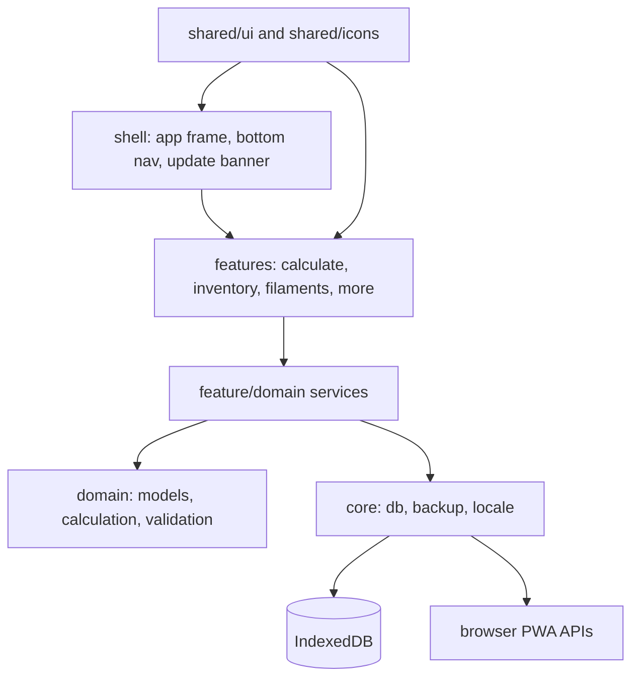
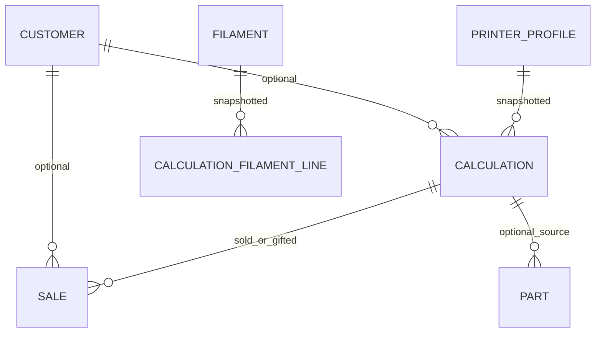
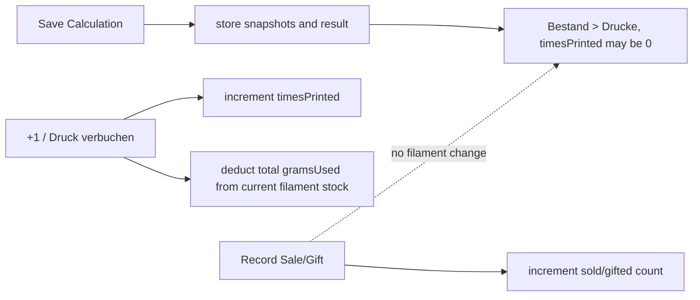

# Architecture Spine - PrintCost

## Design Paradigm

PrintCost is a feature-sliced layered Angular PWA. Lazy feature routes own screens and form orchestration. Shared domain/core services own state, persistence, mutation rules, snapshots, backup, locale, validation, and pure calculations.



## Invariants & Rules

### AD-1 - Current Angular PWA Seed [ADOPTED]

- **Binds:** all epics
- **Prevents:** builders mixing framework generations, routing styles, state libraries, or persistence wrappers.
- **Rule:** Build on Angular 22 standalone components/routes with strict TypeScript, Angular Signals, Typed Reactive Forms, SCSS/CSS custom properties, `idb`, Angular service worker, and Lucide Angular. Do not add a backend, runtime analytics, external fonts, or cloud sync for MVP.

### AD-2 - Layered Feature Boundaries [ADOPTED]

- **Binds:** all feature routes and shared modules
- **Prevents:** route components becoming storage owners or duplicating domain rules.
- **Rule:** Feature screens may orchestrate UI state and call services, but may not call IndexedDB directly. `core/db` is the only IndexedDB adapter. `domain/calculation` has no Angular or storage dependency. `core/backup` may touch all stores only through `core/db`.

### AD-3 - Service-Owned Mutation And Signals [ADOPTED]

- **Binds:** PrinterService, FilamentService, CalculationService, CustomerService, SettingsService, BackupService
- **Prevents:** inconsistent write paths, stale lists, and formula side effects.
- **Rule:** Services expose readonly Signals for query state and async command methods for writes. Every write path validates/sanitizes input before storage, updates IndexedDB through `core/db`, then refreshes affected Signals. Calculation math remains a pure function.

### AD-4 - Correct Calculation Semantics [ADOPTED]

- **Binds:** FR-5, FR-6, FR-7, Epic 4
- **Prevents:** overcharging by multiplying total job inputs by plate count.
- **Rule:** `printMinutes` and each `gramsUsed` value are total job inputs. Plate count never multiplies material, electricity, base-fee, or depreciation costs. Plate count only exposes an optional extra-work fee percent. Use the field name `extraWorkFeePercent` in models, forms, calculation code, and backup v1; do not carry forward PRD draft name `multiPlateSurchargePercent`.

```text
plates = ceil(printQuantity / partsPerPlate)
electricityPerMinute = (powerWatts / 1000) * electricityPriceEurKwh / 60
baseFeePerMinute = annualBaseFeeEur / 365 / 24 / 60
depreciationPerMinute = purchasePriceEur / (lifetimeHours * 60)

materialCost = sum(gramsUsed[i] * pricePerGram[i])
electricityCost = (electricityPerMinute + baseFeePerMinute) * printMinutes
depreciationCost = depreciationPerMinute * printMinutes
modelingCost = modelExists ? 0 : modelingCostEur
subtotalBeforeFee = materialCost + electricityCost + depreciationCost + modelingCost
extraWorkFee = plates > 1 ? subtotalBeforeFee * extraWorkFeePercent / 100 : 0
subtotal = subtotalBeforeFee + extraWorkFee
finalPrice = subtotal * (1 + profitMarginPercent / 100)
roundedFinalPrice = ceil(finalPrice)
```

### AD-5 - Saved Calculation Is Not Printed Inventory [ADOPTED]

- **Binds:** FR-7, FR-8, Epic 4, Epic 5
- **Prevents:** deducting filament when a user saves a quote or planned job for later.
- **Rule:** Saving a Calculation stores snapshots and computed results but does not deduct filament. Saved Calculations appear under `Bestand > Drucke`, including planned entries with `timesPrinted = 0`. Manual Part records appear under `Bestand > Teile`.

### AD-6 - Print Occurrence Owns Stock Deduction [ADOPTED]

- **Binds:** FR-3, FR-8, FR-9, Epic 3, Epic 5
- **Prevents:** double deduction and sales changing filament inventory.
- **Rule:** Only an explicit print occurrence command, such as `+1` or `Druck verbuchen`, increments `timesPrinted` and deducts the saved total `gramsUsed` from current Filament `remainingG`. Resolve by saved `filamentId`, including soft-deleted Filaments. If current stock is lower than required grams, do not block the print occurrence; clamp `remainingG` to `0` and show a German warning. If the Filament record is missing, block the command with a German data error. Sales consume printed inventory count only; they never deduct filament.

### AD-7 - Snapshots And Referential Integrity [ADOPTED]

- **Binds:** FR-2, FR-3, FR-7, FR-9, FR-11
- **Prevents:** historical prices changing after profile, filament, customer, settings, or purchase edits.
- **Rule:** Calculation save stores `printerSnapshot`, each `filamentSnapshot`, selected price modes, calculated price per gram, inputs, and outputs. Printer Profiles, Filaments, Customers, and Calculations use soft delete where referenced historically. Services enforce references because IndexedDB has no foreign keys.

### AD-8 - Backup JSON Is The External Data Contract [ADOPTED]

- **Binds:** FR-14, FR-15, Epic 7
- **Prevents:** destructive partial imports and schema drift.
- **Rule:** Backup export includes schema version, timestamp, all stores, and Settings. Import validates the full object and schema version before clearing data. MVP import is replace-only. Future schema changes require IndexedDB migrations and backup version bumps.

### AD-9 - German UI, English Implementation [ADOPTED]

- **Binds:** all routes, forms, validation, accessibility labels, data contracts
- **Prevents:** German copy leaking into TypeScript contracts or English implementation labels leaking into the UI.
- **Rule:** User-facing copy and accessible names are German. Routes, filenames, interfaces, enum values, store names, tests, and internal documentation stay English. Locale formatting is `de-DE`, EUR, comma decimals, and day-month-year dates.

### AD-10 - Local-Only Static Deployment [ADOPTED]

- **Binds:** NFR-12 through NFR-22, Epic 1, Epic 7
- **Prevents:** hidden network transfer, sync assumptions, and service-worker writes to user data.
- **Rule:** MVP deploys as static files, defaulting to GitHub Pages. All user-created data remains in browser IndexedDB unless manually exported. Service worker precaches app shell/local assets only. Update availability is shown as a non-blocking banner and reload is user-controlled. Hosted CSP denies network connections.

### AD-11 - Performance And Verification Gates [ADOPTED]

- **Binds:** NFR-1 through NFR-5, SM-1 through SM-5
- **Prevents:** formula regressions, oversized bundles, and route-level eager loading.
- **Rule:** Calculation formulas get unit tests for plate, price-mode, modeling, margin, and rounding cases. Production build uses lazy-loaded feature routes. CI should run tests, production build, bundle budget check, and Lighthouse/PWA checks where practical.

## Consistency Conventions

| Concern | Convention |
| --- | --- |
| Naming | English TypeScript symbols; German visible labels; route paths are `/calculate`, `/inventory`, `/filaments`, `/more`. |
| IDs and dates | `UUID` strings for entity IDs; ISO date/time strings in storage and backup; `de-DE` formatting only at presentation edges. |
| Money and units | Store numeric EUR, grams, minutes, percent values as numbers; format with locale helpers in UI. |
| Plate fee naming | Use `extraWorkFeePercent`; do not use `multiPlateSurchargePercent` in new code or backup fields. |
| Validation | Trim all text before storage; enforce PRD length/range limits in forms and service commands. |
| Errors | Inline German validation for form fields; destructive import/delete uses confirmation before mutation. |
| Deletion | Soft delete historical entities; full local data deletion is a confirmed settings action. |
| Accessibility | German accessible names; focus order follows visual order; reduced motion honored; color never sole state indicator. |

## Stack

| Name | Version |
| --- | --- |
| Angular core/router/forms/service-worker | 22.0.2 |
| Angular CLI | 22.0.3 |
| TypeScript | 6.0.3 |
| idb | 8.0.3 |
| lucide-angular | 1.0.0 |
| Sass | 1.101.0 |

## Structural Seed

```text
src/app/
  app.config.ts
  app.routes.ts
  shell/                 # app frame, bottom navigation, update banner
  core/
    db/                  # idb connection, schema v1, migrations, store helpers
    backup/              # BackupFormat validation, export, replace import
    locale/              # de-DE currency, date, decimal, unit formatters
  domain/
    models/              # English interfaces, enums, store types
    calculation/         # pure calculate() and unit tests
    validation/          # shared sanitizers, range checks, schema guards
  features/
    calculate/           # quote/planned calculation form and result card
    inventory/           # Bestand > Drucke and Bestand > Teile
    filaments/           # filament list, detail, purchase history
    more/                # printers, customers, settings, templates, backup
  shared/
    ui/                  # reusable tokenized controls
    icons/               # Lucide registration/aliases
```





### IndexedDB v1 Stores

| Store | Key | Indexes |
| --- | --- | --- |
| `printers` | `id` | none |
| `filaments` | `id` | `type`, `deleted` |
| `calculations` | `id` | `customerId`, `deleted`, `updatedAt` |
| `sales` | `id` | `calculationId`, `customerId`, `date` |
| `customers` | `id` | `deleted` |
| `templates` | `id` | `updatedAt` |
| `parts` | `id` | `calculationId` |
| `settings` | `key` | none |

### Hosted Envelope

```text
GitHub Pages
  static Angular production build
  web app manifest
  Angular service worker app-shell precache
  locally bundled DM Sans and icons
  strict CSP with connect-src 'none'

Browser
  IndexedDB stores all user data
  File picker/download handles manual backup import/export
```

## Capability To Architecture Map

| Capability / Area | Lives in | Governed by |
| --- | --- | --- |
| Printer Profiles | `features/more`, `domain/models`, `core/db` | AD-2, AD-3, AD-7 |
| Filament Inventory | `features/filaments`, `domain/models`, `core/db` | AD-2, AD-3, AD-6, AD-7 |
| Calculation | `features/calculate`, `domain/calculation` | AD-3, AD-4, AD-5, AD-7, AD-11 |
| Inventory and Sales | `features/inventory`, `core/db` | AD-5, AD-6, AD-7 |
| Customers | `features/more`, `domain/models`, `core/db` | AD-3, AD-7, AD-9 |
| Settings | `features/more`, `core/db` | AD-3, AD-8, AD-9 |
| Templates | `features/more`, `features/calculate`, `core/db` | AD-3, AD-5, AD-7 |
| Backup and Restore | `features/more`, `core/backup`, `core/db` | AD-8, AD-10 |
| PWA and Deployment | `shell`, Angular service worker, GitHub Pages | AD-1, AD-10, AD-11 |
| German UX and Design Tokens | `shared/ui`, feature components, `core/locale` | AD-9, UX spines |

## Deferred

| Decision | Revisit when |
| --- | --- |
| Merge import | Post-MVP import must preserve existing local records instead of replace-all. |
| Cloud sync/accounts | User demand justifies breaking the local-only MVP promise. |
| Backend/API | Static hosting cannot satisfy a future capability such as sync, shared accounts, or server-side backup. |
| CSV export | Product pulls CSV into MVP; PRD currently treats it as post-MVP. |
| Custom PWA icons | Visual release polish needs final app icon assets; placeholders may serve during implementation. |
| Desktop two-pane layout | Inventory or More workflows prove too slow in centered single-column desktop layout. |
| Sale deletion/editing policy | Users need correction workflows beyond append-only sale history and full local deletion/import. |
