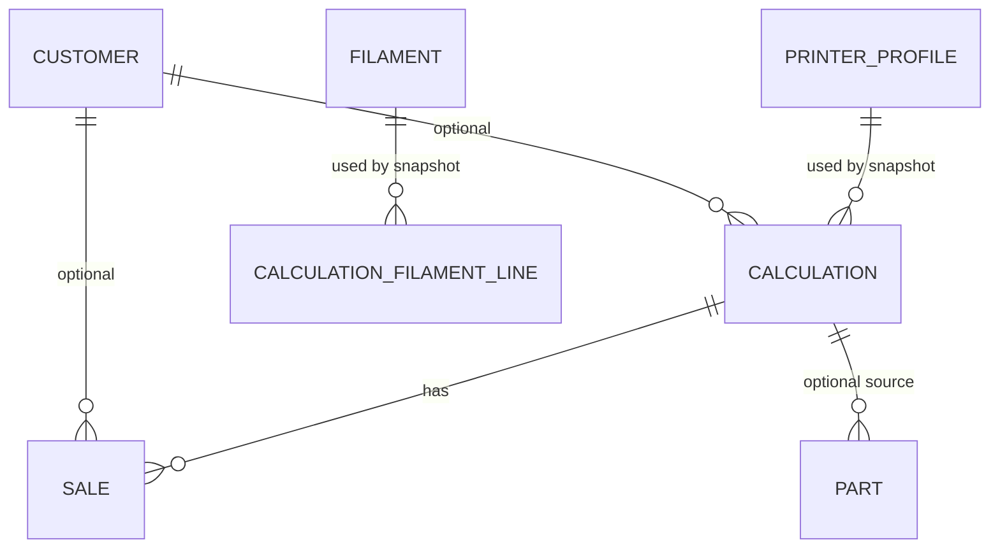

# PRD: PrintCost - 3D Print Cost Calculator

*Version 1.0 - June 2026 - Confidential*

## 0. Document Purpose

This PRD defines the MVP requirements for PrintCost, an offline-capable progressive web app for calculating, storing, and tracking 3D print costs. It is intended for UX, architecture, implementation planning, and backlog creation. The document uses English domain terminology throughout for feature names, data models, field names, service contracts, routes, and implementation-facing examples. The user-facing application UI is German.

## 1. Vision

PrintCost helps makers and small 3D printing sellers calculate a reliable selling price in less than 30 seconds. It replaces fragile spreadsheets with a mobile-first app that tracks printers, filament purchases, weighted material costs, completed prints, customers, and sales history.

The app is designed for individual operators who need practical cost control without the overhead of accounts, cloud sync, ERP tooling, or app-store distribution. It works offline after the first load, stores all data locally in the browser, and can be installed on iOS, Android, and desktop as a PWA.

## 2. Target User

### 2.1 Primary User

The primary user is a technically comfortable maker who owns one or more FDM 3D printers and occasionally or regularly prints parts for friends, customers, local marketplaces, or personal inventory.

### 2.2 Secondary User

The secondary user is a very small maker business that needs lightweight pricing and tracking but does not need multi-user workflows, invoicing, tax handling, or a dedicated ERP system.

### 2.3 Jobs To Be Done

- Calculate a defensible price for a print job while standing near the printer or talking to a customer.
- Maintain printer cost profiles so energy cost, depreciation, and fixed operating fees are not forgotten.
- Track filament rolls, color, type, purchase history, remaining material, and cost basis.
- Store calculations and inventory counts so repeated prints can be tracked without recalculating.
- Record sales after the fact with customer, price, date, and gift status.
- Back up local data manually without creating an account or using cloud sync.

### 2.4 Non-Users for MVP

- Teams that need shared accounts, permissions, or multi-operator workflows.
- Businesses that need invoices, tax calculation, bookkeeping, or ERP integration.
- Resin-only workflows where pricing is primarily volume-based rather than gram-based.
- Users who require automatic printer telemetry or OctoPrint integration.

### 2.5 Key User Journeys

- **UJ-1. Alex prices a new customer print.** Alex opens PrintCost on a phone, lands on the calculation screen, selects a printer profile, selects one or more filaments, enters print minutes, grams used, quantity, and parts per plate, then sees a live cost breakdown and rounded selling price. Alex saves the calculation, and it appears in print inventory.

- **UJ-2. Alex adds a new filament purchase.** Alex buys a 1 kg black PETG roll for EUR 21.99, opens the filament inventory, creates a filament record with type, color, manufacturer, roll weight, remaining amount, purchase price, and purchase date, then sees the weighted average cost update automatically.

- **UJ-3. Alex records a sale after printing.** Alex has printed three dice towers and sells one later. Alex opens inventory, selects the saved dice tower calculation, records a sale with optional customer, price, date, and gift flag, then sees the inventory card update to "1 of 3 sold."

## 3. Glossary

- **Printer Profile** - A saved printer cost profile containing power draw, purchase price, expected lifetime, electricity price, optional annual base fee, and notes.
- **Filament** - A material inventory record for FDM printing, including type, color, manufacturer, roll weight, remaining grams, purchase history, and optional fixed price override.
- **Filament Purchase** - A dated purchase entry with price and quantity used to calculate weighted average material cost.
- **Price Mode** - The method used to price filament in a calculation: weighted average, last paid price, or fixed manual price.
- **Calculation** - A saved print job cost calculation with printer snapshot, filament snapshots, inputs, computed cost breakdown, and rounded selling price.
- **Plate** - One physical printer build plate run. A multi-quantity print can require multiple plates based on `partsPerPlate`.
- **Inventory** - Saved calculations and manually entered parts available for tracking, counting, and sale recording.
- **Sale** - A recorded transaction or gift against a saved calculation.
- **Customer** - An optional local contact record used to associate calculations and sales.
- **Template** - A reusable calculation input set that can prefill a future calculation.
- **Backup** - A user-triggered JSON export of all local data.

## 4. MVP Scope

### 4.1 In Scope

- Printer profile CRUD with soft-delete behavior for referenced records.
- Filament inventory with purchase history, color management, remaining quantity, and weighted average pricing.
- Single-print and multi-color calculation with plate logic, model cost, profit margin, and rounded final price.
- Price mode selection per filament line: weighted average, paid price, or fixed manual price.
- Calculation saving, print inventory, manual sale recording, and `+1` print count.
- Customer records with name and free-text contact/notes.
- Calculation templates.
- JSON export/import for manual backup and restore.
- Installable offline PWA with local browser persistence.

### 4.2 Out of Scope for MVP

- Backend, server storage, accounts, login, cloud sync, or multi-user operation.
- Invoicing, tax calculation, accounting, or payment processing.
- Resin-specific volume calculations.
- OctoPrint or printer telemetry integration.
- Automatic scale measurement.
- Statistics dashboard, monthly revenue analysis, and CSV export.
- Web Push notifications.
- Photo attachments.

## 5. Features and Functional Requirements

### 5.1 Printer Profiles

**Description:** Users can manage multiple Printer Profiles and select one for each Calculation. Calculations store a Printer Profile snapshot so historical results remain stable after profile edits or deletion.

#### FR-1: Create and edit Printer Profiles

Users can create and edit Printer Profiles with the following fields.

| Field | Type | Required | Validation |
| --- | --- | --- | --- |
| `name` | string | Yes | 1-60 characters |
| `powerWatts` | number | Yes | > 0 and <= 5000 |
| `purchasePriceEur` | number | Yes | > 0 |
| `lifetimeHours` | number | Yes | > 0 |
| `electricityPriceEurKwh` | number | Yes | > 0 and <= 10 |
| `annualBaseFeeEur` | number | No | >= 0 |
| `note` | string | No | max 500 characters |

**Consequences:**
- The system rejects invalid numbers and missing required fields.
- If no active Printer Profile exists, the calculation screen tells the user to create one first.

#### FR-2: Preserve historical printer costs

When a Printer Profile used by saved Calculations is deleted, the system soft-deletes it and keeps each Calculation's stored `printerSnapshot`.

**Consequences:**
- Saved Calculations remain readable and reproducible after profile deletion.
- Soft-deleted profiles are hidden from new Calculation selection.

### 5.2 Filament Inventory

**Description:** Users maintain Filament records with purchase history, color, type, remaining amount, and optional pricing overrides. Filament can still be referenced historically after deletion through snapshots.

#### FR-3: Create and edit Filaments

Users can create and edit Filaments with the following fields.

| Field | Type | Required | Validation |
| --- | --- | --- | --- |
| `name` | string | Yes | 1-60 characters, unique among active Filaments |
| `type` | enum | Yes | `PLA`, `PETG`, `ABS`, `TPU`, `OTHER` |
| `colorHex` | string | Yes | valid `#RRGGBB` value |
| `manufacturer` | string | No | max 60 characters |
| `rollWeightG` | number | Yes | > 0 and <= 10000 |
| `remainingG` | number | Yes | >= 0 and <= `rollWeightG` |
| `purchases` | array | Yes | at least one entry |
| `purchases[].priceEur` | number | Yes | > 0 |
| `purchases[].quantityKg` | number | Yes | > 0 |
| `purchases[].date` | ISO date | Yes | valid date |
| `multiColorSurchargeEurKg` | number | No | >= 0, default 2.00 |
| `fixedPriceEurG` | number | No | > 0 when used |

**Consequences:**
- Filaments with `remainingG = 0` remain selectable because physical inventory may be approximate.
- Deleting a Filament used by saved Calculations soft-deletes it and preserves snapshots.

#### FR-4: Calculate filament cost basis

The system supports three Price Modes for each filament line in a Calculation.

| Price Mode | Rule |
| --- | --- |
| `WEIGHTED_AVERAGE` | `sum(priceEur * quantityKg) / sum(quantityKg) / 1000` |
| `PAID` | last purchase price per gram |
| `FIXED` | manual `fixedPriceEurG` |

**Consequences:**
- Weighted average updates whenever a Filament Purchase is added, edited, or removed.
- Price Mode is stored on each Calculation filament line.

### 5.3 Calculation

**Description:** Users calculate print price from Printer Profile costs, Filament costs, print duration, quantity, plate count, modeling cost, and profit margin. The result updates in real time without a submit step. Realizes UJ-1.

#### FR-5: Enter Calculation inputs

The calculation form supports these inputs.

| Field | Type | Required | Default / Validation |
| --- | --- | --- | --- |
| `projectName` | string | No | empty |
| `printerProfileId` | UUID | Yes | last used active Printer Profile when available |
| `customerId` | UUID/null | No | null means personal/no customer |
| `filaments` | array | Yes | at least one line |
| `filaments[].filamentId` | UUID | Yes | active or selected historical Filament |
| `filaments[].gramsUsed` | number | Yes | > 0 |
| `filaments[].priceMode` | enum | Yes | `WEIGHTED_AVERAGE`, `PAID`, `FIXED` |
| `filaments[].fixedPriceEurG` | number | Conditional | required when `priceMode = FIXED`, > 0 |
| `printMinutes` | number | Yes | > 0 |
| `printQuantity` | number | Yes | >= 1, default 1 |
| `partsPerPlate` | number | Yes | >= 1, default 1 |
| `extraWorkFeePercent` | number | No | 0-100, applies when plates > 1 |
| `modelExists` | boolean | Yes | false |
| `modelingCostEur` | number | No | from Settings |
| `profitMarginPercent` | number | Yes | from Settings |

#### FR-6: Calculate cost breakdown and rounded price

The system calculates price with the following rules.

```text
plates = ceil(printQuantity / partsPerPlate)
electricityPerMinute = (powerWatts / 1000) * electricityPriceEurKwh / 60
baseFeePerMinute = annualBaseFeeEur / 365 / 24 / 60
depreciationPerMinute = purchasePriceEur / (lifetimeHours * 60)

electricityCost = (electricityPerMinute + baseFeePerMinute) * printMinutes
depreciationCost = depreciationPerMinute * printMinutes
materialCost = sum(gramsUsed[i] * pricePerGram[i])
extraWorkFee = plates > 1 ? (electricityCost + depreciationCost) * extraWorkFeePercent / 100 : 0
modelingCost = modelExists ? 0 : modelingCostEur
subtotal = materialCost + electricityCost + depreciationCost + extraWorkFee + modelingCost
finalPrice = subtotal * (1 + profitMarginPercent / 100)
roundedFinalPrice = ceil(finalPrice)
```

**Consequences:**
- Any input change updates the visible result within 100 ms on a typical target device.
- The result card shows material cost, electricity cost, depreciation cost, modeling cost, extra work fee, subtotal, final price, and rounded final price.
- Multi-color jobs calculate material cost separately for each Filament line and show total grams.
- `printMinutes` and `gramsUsed` are job totals; plate count is used for plate display and optional extra work fee only.

#### FR-7: Save Calculation snapshots

When a Calculation is saved, the system stores the current Printer Profile snapshot, Filament snapshots, selected Price Modes, calculated price per gram, input fields, and computed outputs.

**Consequences:**
- Historical Calculations remain stable after later edits to Printer Profiles, Filaments, Settings, or purchases.

### 5.4 Inventory and Sales

**Description:** Users manage saved Calculations, increase print counts, track sales, and maintain manually entered parts. Realizes UJ-3.

#### FR-8: Manage saved print inventory

Users can view saved Calculations in an Inventory screen with a Prints tab.

**Consequences:**
- The list supports filters for all, in stock, partially sold, fully sold, and gifted.
- Each saved Calculation shows project name, quantity printed, quantity sold, rounded price, and last update date.
- A `+1` action increments `timesPrinted` without creating a new Calculation.
- Recording a print occurrence deducts the saved total `gramsUsed` for each filament line from the current Filament `remainingG` by `filamentId`, including soft-deleted Filaments when the record still exists.
- Low stock does not block print occurrence; `remainingG` may clamp to `0` with a warning if needed.

#### FR-9: Record sales and gifts

Users can record a Sale against a saved Calculation with optional Customer, sale price, gift flag, date, and note.

**Consequences:**
- A sale price of 0 can be represented as a gift.
- The print inventory card updates sold/remaining counts after a Sale is saved.

#### FR-10: Track manual parts

Users can create manual Part records with name, optional linked Calculation, and quantity.

**Consequences:**
- Part quantity can be adjusted inline with increment/decrement controls.
- Parts without a linked Calculation remain valid.

### 5.5 Customers

**Description:** Users maintain a simple local Customer list for associating Calculations and Sales.

#### FR-11: Manage Customers

Users can create, edit, soft-delete, and select Customers with these fields.

| Field | Type | Required | Validation |
| --- | --- | --- | --- |
| `name` | string | Yes | 1-80 characters |
| `contact` | string | No | max 500 characters |
| `note` | string | No | max 500 characters |

**Consequences:**
- Customers have no login and no role permissions.
- A Calculation or Sale can have no Customer.

### 5.6 Settings

**Description:** Users define global defaults that prefill new Calculations and Filaments.

#### FR-12: Manage calculation defaults

Users can set default Price Mode, profit margin, modeling cost, and multi-color surcharge.

**Consequences:**
- Defaults apply only to future entries unless the user edits an existing record.
- Defaults can be overridden per Calculation or Filament where applicable.

### 5.7 Templates

**Description:** Users can save reusable Calculation input sets.

#### FR-13: Save and load Templates

Users can save a Calculation as a Template and later load it into the calculation form.

**Consequences:**
- Loading a Template pre-fills the form but all fields remain editable.
- Template name is independent of `projectName`.

### 5.8 Backup and Restore

**Description:** Users can manually export and import all local data without backend infrastructure.

#### FR-14: Export Backup JSON

Users can export all local data as `printcost-backup-YYYY-MM-DD.json`.

**Consequences:**
- The export includes schema version, export timestamp, all stores, and Settings.

#### FR-15: Import Backup JSON with replace strategy

Users can import a Backup JSON file after schema validation and confirmation.

**Consequences:**
- MVP import replaces the full local data set.
- The system shows a confirmation dialog warning about data replacement.
- Merge import is explicitly deferred to post-MVP.

## 6. Cross-Cutting Non-Functional Requirements

### 6.1 Performance

- NFR-1: Time to Interactive must be under 3 seconds on a typical mobile 4G connection.
- NFR-2: Calculation result updates must complete within 100 ms after input changes.
- NFR-3: Initial gzipped bundle size should stay under 200 KB.
- NFR-4: Typical IndexedDB read/write operations should complete within 50 ms.
- NFR-5: Production build must use lazy-loaded feature routes.

### 6.2 Responsiveness and Accessibility

- NFR-6: The UI must be mobile-first and fully usable at 320 px viewport width.
- NFR-7: Interactive controls must meet WCAG 2.2 AA contrast requirements.
- NFR-8: The app must support keyboard navigation with visible focus states.
- NFR-9: Icon-only controls and toggles must have accessible labels.
- NFR-10: Motion must respect `prefers-reduced-motion`.
- NFR-11: Touch targets must be at least 44 x 44 px.

### 6.3 Privacy and Security

- NFR-12: No runtime analytics, tracking, external fonts, or external runtime dependencies.
- NFR-13: User data must remain on the user's device unless the user manually exports it.
- NFR-14: All text inputs must be trimmed and length-limited before storage.
- NFR-15: User input must not be rendered through unsafe `innerHTML`.
- NFR-16: The app must not use `eval()`.
- NFR-17: JSON import must validate schema before writing to IndexedDB.
- NFR-18: A strict Content Security Policy should be used for hosted deployments.

### 6.4 Offline and PWA Behavior

- NFR-19: Calculation, Inventory, Filaments, Customers, Settings, Templates, export, and import must work offline after initial app load.
- NFR-20: Service Worker caching uses app-shell precache and local assets only.
- NFR-21: When a new service worker version is available, the app shows a non-blocking update banner and lets the user choose when to reload.
- NFR-22: HTTPS is required for hosted PWA deployment.

### 6.5 Browser Support

| Platform | Browser | Minimum |
| --- | --- | --- |
| iOS | Safari | 15.4+ |
| Android | Chrome | 90+ |
| Desktop | Chrome / Edge | 90+ |
| Desktop | Firefox | 90+ |
| Desktop | Safari | 15.4+ |

## 7. Data Model

### 7.1 IndexedDB Stores

| Store Name | Key | Indexes |
| --- | --- | --- |
| `printers` | `id` UUID | none |
| `filaments` | `id` UUID | `type`, `deleted` |
| `calculations` | `id` UUID | `customerId`, `deleted`, `updatedAt` |
| `sales` | `id` UUID | `calculationId`, `customerId`, `date` |
| `customers` | `id` UUID | `deleted` |
| `templates` | `id` UUID | `updatedAt` |
| `parts` | `id` UUID | `calculationId` |
| `settings` | `key` string | none |

### 7.2 TypeScript Interfaces

```typescript
type UUID = string;
type IsoDate = string;
type IsoDateTime = string;

type FilamentType = 'PLA' | 'PETG' | 'ABS' | 'TPU' | 'OTHER';
type PriceMode = 'WEIGHTED_AVERAGE' | 'PAID' | 'FIXED';

interface PrinterProfile {
  id: UUID;
  name: string;
  powerWatts: number;
  purchasePriceEur: number;
  lifetimeHours: number;
  electricityPriceEurKwh: number;
  annualBaseFeeEur: number;
  note?: string;
  createdAt: IsoDateTime;
  updatedAt: IsoDateTime;
  deleted: boolean;
}

interface FilamentPurchase {
  priceEur: number;
  quantityKg: number;
  date: IsoDate;
}

interface Filament {
  id: UUID;
  name: string;
  type: FilamentType;
  colorHex: string;
  manufacturer?: string;
  rollWeightG: number;
  remainingG: number;
  purchases: FilamentPurchase[];
  multiColorSurchargeEurKg: number;
  fixedPriceEurG?: number;
  createdAt: IsoDateTime;
  updatedAt: IsoDateTime;
  deleted: boolean;
}

interface CalculationFilamentLine {
  filamentId: UUID;
  filamentSnapshot: Filament;
  gramsUsed: number;
  priceMode: PriceMode;
  fixedPriceEurG?: number;
  calculatedPriceEurG: number;
}

interface CalculationInput {
  projectName: string;
  printerProfileId: UUID;
  customerId?: UUID | null;
  filaments: CalculationFilamentLine[];
  printMinutes: number;
  printQuantity: number;
  partsPerPlate: number;
  extraWorkFeePercent: number;
  modelExists: boolean;
  modelingCostEur: number;
  profitMarginPercent: number;
}

interface CalculationResult {
  plates: number;
  totalFilamentG: number;
  materialCostEur: number;
  electricityCostEur: number;
  depreciationCostEur: number;
  multiPlateSurchargeEur: number;
  modelingCostEur: number;
  subtotalEur: number;
  finalPriceEur: number;
  roundedFinalPriceEur: number;
}

interface Calculation extends CalculationInput, CalculationResult {
  id: UUID;
  printerSnapshot: PrinterProfile;
  timesPrinted: number;
  createdAt: IsoDateTime;
  updatedAt: IsoDateTime;
  deleted: boolean;
}

interface Sale {
  id: UUID;
  calculationId: UUID;
  customerId?: UUID | null;
  salePriceEur: number;
  gifted: boolean;
  date: IsoDate;
  note?: string;
  createdAt: IsoDateTime;
}

interface Customer {
  id: UUID;
  name: string;
  contact?: string;
  note?: string;
  createdAt: IsoDateTime;
  updatedAt: IsoDateTime;
  deleted: boolean;
}

interface Part {
  id: UUID;
  name: string;
  calculationId?: UUID | null;
  quantity: number;
  note?: string;
  createdAt: IsoDateTime;
  updatedAt: IsoDateTime;
}

interface Settings {
  defaultPriceMode: PriceMode;
  defaultProfitMarginPercent: number;
  defaultModelingCostEur: number;
  defaultMultiColorSurchargeEurKg: number;
  autoDeductFilamentOnSave: boolean;
}

interface BackupFormat {
  version: number;
  exportedAt: IsoDateTime;
  printers: PrinterProfile[];
  filaments: Filament[];
  calculations: Calculation[];
  sales: Sale[];
  customers: Customer[];
  templates: CalculationInput[];
  parts: Part[];
  settings: Settings;
}
```

### 7.3 Entity Relationships



**Data model rules:**
- IndexedDB does not enforce foreign keys; services must enforce referential behavior.
- Printer Profiles, Filaments, Customers, and Calculations use soft-delete where historical records may reference them.
- Snapshots preserve historical cost correctness.
- Schema upgrades must be versioned through IndexedDB upgrade callbacks.

## 8. Internal Service Contracts

These are internal application contracts, not backend APIs.

### 8.1 PrinterService

```typescript
interface PrinterService {
  getAll(): Signal<PrinterProfile[]>;
  getById(id: UUID): PrinterProfile | undefined;
  create(data: Omit<PrinterProfile, 'id' | 'createdAt' | 'updatedAt' | 'deleted'>): Promise<PrinterProfile>;
  update(id: UUID, data: Partial<PrinterProfile>): Promise<PrinterProfile>;
  delete(id: UUID): Promise<void>;
}
```

### 8.2 FilamentService

```typescript
interface FilamentService {
  getAll(): Signal<Filament[]>;
  getById(id: UUID): Filament | undefined;
  create(data: Omit<Filament, 'id' | 'createdAt' | 'updatedAt' | 'deleted'>): Promise<Filament>;
  update(id: UUID, data: Partial<Filament>): Promise<Filament>;
  delete(id: UUID): Promise<void>;
  addPurchase(filamentId: UUID, purchase: FilamentPurchase): Promise<Filament>;
  getWeightedAveragePriceEurG(filamentId: UUID): number;
  getLastPaidPriceEurG(filamentId: UUID): number;
}
```

### 8.3 CalculationService

```typescript
interface CalculationService {
  calculate(input: CalculationInput): CalculationResult;
  save(input: CalculationInput): Promise<Calculation>;
  getAll(): Signal<Calculation[]>;
  getById(id: UUID): Calculation | undefined;
  incrementTimesPrinted(id: UUID): Promise<Calculation>;
  addSale(calculationId: UUID, sale: Omit<Sale, 'id' | 'calculationId' | 'createdAt'>): Promise<Sale>;
  delete(id: UUID): Promise<void>;
}
```

### 8.4 BackupService

```typescript
interface BackupService {
  exportBackupJson(): void;
  importBackupJson(file: File): Promise<void>;
}
```

## 9. Information Architecture

### 9.1 Primary Navigation

The route names and implementation identifiers are English. The visible navigation labels are German.

| Route | German UI Label | Purpose |
| --- | --- | --- |
| `/calculate` | `Kalkulation` | Default route and primary pricing workflow |
| `/inventory` | `Bestand` | Saved Calculations, print counts, Sales, and Parts |
| `/filaments` | `Filamente` | Filament inventory and purchase history |
| `/more` | `Mehr` | Customers, Printer Profiles, Settings, Templates, backup/export/import, update status, and data deletion |

### 9.2 Route Structure

```typescript
export const routes: Routes = [
  { path: '', redirectTo: 'calculate', pathMatch: 'full' },
  { path: 'calculate', loadComponent: () => import('./features/calculate/calculate.component') },
  { path: 'inventory', loadComponent: () => import('./features/inventory/inventory.component') },
  { path: 'filaments', loadComponent: () => import('./features/filaments/filaments.component') },
  { path: 'more', loadComponent: () => import('./features/more/more.component') },
  { path: '**', redirectTo: 'calculate' }
];
```

## 10. Platform and Technical Constraints

- Frontend framework: Angular 18+ with standalone components and strict TypeScript.
- Reactive state: Angular Signals for feature services and derived calculation state.
- Forms: Typed Reactive Forms for major forms; simple inline controls may use lightweight alternatives.
- Styling: SCSS and CSS custom properties.
- Icons: Lucide Angular or equivalent tree-shakeable icon set.
- Persistence: IndexedDB through a small typed wrapper or `idb`.
- PWA: Angular service worker and web app manifest.
- Hosting: Static hosting such as GitHub Pages, Netlify, Vercel, local static server, or an existing web server.
- CI/CD: Build and optional static deployment on push to main.

## 11. Localization and German UI Requirements

- UI-1: All user-facing copy must be German, including navigation labels, form labels, validation errors, helper text, empty states, buttons, dialogs, toasts, onboarding, update banners, backup warnings, and data deletion confirmations.
- UI-2: Implementation identifiers remain English, including TypeScript interfaces, field names, service names, route paths, store names, enum values, tests, and internal documentation.
- UI-3: Currency, dates, decimal separators, and number formatting must default to German conventions: EUR currency, `de-DE` locale formatting, comma decimal separator, and day-month-year date display.
- UI-4: The first release does not require a runtime language switcher. German is the only product UI language for MVP.
- UI-5: Accessibility labels are user-facing copy and therefore must be German.
- UI-6: Exported backup field names follow the English `BackupFormat` contract; generated filenames remain implementation-defined as `printcost-backup-YYYY-MM-DD.json`.

## 12. Security and Privacy Details

### 12.1 Data Localization

All user-created data remains in browser IndexedDB. Hosted deployments deliver static application files only. No backend receives user data in the MVP.

### 12.2 Content Security Policy

Recommended CSP for hosted deployments:

```text
Content-Security-Policy:
default-src 'self';
script-src 'self';
style-src 'self' 'unsafe-inline';
font-src 'self';
img-src 'self' data:;
connect-src 'none';
frame-src 'none';
```

### 12.3 Data Deletion

- Soft-delete preserves historical references.
- Settings must include a full local data deletion action with confirmation.
- The UI should recommend a Backup export before full deletion.

## 13. Success Metrics

**Primary**

- **SM-1:** Calculation completion from first input to visible price in under 30 seconds for a typical print. Validates FR-5 and FR-6.
- **SM-2:** Offline availability covers 100% of core calculation, inventory, filament, customer, settings, template, export, and import workflows. Validates FR-1 through FR-15.
- **SM-3:** Lighthouse PWA score >= 90 and mobile performance score >= 85 on production build. Validates NFR-1, NFR-3, and NFR-19.

**Secondary**

- **SM-4:** All German user-facing interactive controls meet WCAG 2.2 AA contrast and keyboard access expectations. Validates NFR-6 through NFR-11.
- **SM-5:** Initial gzipped bundle remains below 200 KB. Validates NFR-3 and NFR-5.

**Counter-metrics**

- **SM-C1:** Do not optimize for enterprise/accounting completeness at the expense of fast calculation entry.
- **SM-C2:** Do not optimize for automatic cloud convenience at the expense of the no-account, offline-first MVP promise.

## 14. Delivery Plan

### Phase 0: Foundation, 1-2 days

- Create Angular PWA with standalone components and strict TypeScript.
- Configure PWA manifest and service worker.
- Define IndexedDB schema v1 and migration path.
- Create lazy-loaded route shell and bottom navigation.
- Create design tokens for color, spacing, and typography.
- Set up repository build and optional static deployment.

**Definition of Done:** Production build succeeds, app shell loads, PWA install/offline baseline passes, and IndexedDB schema initializes.

### Phase 1: MVP Core, 5-8 days

- Implement Printer Profiles.
- Implement Filament Inventory and purchase history.
- Implement Calculation engine, live result card, multi-color, and plate logic.
- Implement Inventory Prints tab, `+1` count, detail view, and Sale recording.
- Implement Customers.
- Implement Settings.
- Implement Backup export/import.
- Test offline behavior on iOS Safari and Android Chrome.

**Definition of Done:** All P0/P1 MVP workflows work offline, calculation values are unit-tested, and PWA/performance targets are met or explicitly waived.

### Phase 2: Completion and Polish, 3-4 days

- Implement Parts tab.
- Implement Templates.
- Add filters and search to Inventory and Filaments.
- Add first-run onboarding with iOS storage warning.
- Add service worker update banner.
- Add CSV export if pulled forward from post-MVP.

### Phase 3: Post-MVP Options

- Statistics dashboard and monthly revenue view.
- Optional PIN protection.
- Merge import.
- Photo attachment per Calculation.
- Push notification experiments.

## 15. Backlog Starter

### Epic 1: Platform Foundation

| ID | Title | Priority | Notes |
| --- | --- | --- | --- |
| E1-T1 | Angular PWA setup with standalone routing and bottom navigation | P0 | Add service worker and manifest |
| E1-T2 | IndexedDB schema v1 | P0 | Stores from section 7.1 |
| E1-T3 | Design token system | P0 | Color, spacing, type scale |
| E1-T4 | CI/CD static deployment | P0 | Build and optional GitHub Pages deploy |
| E1-T5 | Shared UI components | P1 | Color swatch, filament chip, price display |

### Epic 2: Printer Profiles

| ID | Title | Priority | Notes |
| --- | --- | --- | --- |
| E2-T1 | `PrinterService` with Signal state and IndexedDB persistence | P0 | CRUD and soft-delete |
| E2-T2 | Printer profile list and form | P0 | Typed Reactive Form |
| E2-T3 | Empty printer state in calculation screen | P0 | Blocks calculation until one profile exists |

### Epic 3: Filament Inventory

| ID | Title | Priority | Notes |
| --- | --- | --- | --- |
| E3-T1 | `FilamentService` with weighted average pricing | P0 | Includes purchases |
| E3-T2 | Filament list with type filter and search | P0 | Mobile-first |
| E3-T3 | Filament create/edit form | P0 | Color picker and purchase array |
| E3-T4 | Add purchase from filament detail | P0 | Updates weighted average |
| E3-T5 | Remaining amount indicator | P1 | Lightweight visual only |

### Epic 4: Calculation

| ID | Title | Priority | Notes |
| --- | --- | --- | --- |
| E4-T1 | Pure `calculate()` function | P0 | Unit-test all formulas |
| E4-T2 | Calculation form | P0 | Typed Reactive Form |
| E4-T3 | Live result card | P0 | Signal-based derived state |
| E4-T4 | Multi-color filament lines | P0 | Dynamic form array |
| E4-T5 | Plate logic and surcharge | P0 | Conditional field |
| E4-T6 | Save Calculation with snapshots | P0 | Freeze cost inputs |
| E4-T7 | Load Template in calculation screen | P1 | Prefill but remain editable |

### Epic 5: Inventory and Sales

| ID | Title | Priority | Notes |
| --- | --- | --- | --- |
| E5-T1 | Inventory screen with tabs | P0 | Prints and Parts |
| E5-T2 | Prints list with filters | P0 | In stock, sold, gifted |
| E5-T3 | `+1` print count action | P1 | Optimistic UI acceptable |
| E5-T4 | Calculation detail view | P1 | Cost breakdown and sale list |
| E5-T5 | Record Sale form | P1 | Customer, price, gift flag |
| E5-T6 | Parts tab with inline quantity controls | P1 | Manual entries allowed |

### Epic 6: Customers

| ID | Title | Priority | Notes |
| --- | --- | --- | --- |
| E6-T1 | `CustomerService` with IndexedDB persistence | P1 | CRUD and soft-delete |
| E6-T2 | Customer list and form | P1 | Free-text contact fields |
| E6-T3 | Customer selector in Calculation and Sale forms | P1 | Null means no customer |

### Epic 7: Settings and Backup

| ID | Title | Priority | Notes |
| --- | --- | --- | --- |
| E7-T1 | `SettingsService` | P0 | Defaults from section 7.2 |
| E7-T2 | Settings screen | P1 | Defaults, deletion, import/export |
| E7-T3 | Backup JSON export | P1 | `BackupFormat` contract |
| E7-T4 | Backup JSON import with validation | P1 | Replace strategy |
| E7-T5 | Service worker update banner | P1 | User-controlled reload |

## 16. Risks and Mitigations

| Risk | Likelihood | Impact | Mitigation |
| --- | --- | --- | --- |
| Browser or iOS storage eviction causes data loss | Medium | High | First-run warning and recurring Backup reminder |
| Mobile calculation form feels too dense | Medium | High | Split into compact sections with smart defaults and live summary |
| Multi-color gram entry is confusing | Medium | Medium | Show per-line and total grams with clear validation |
| IndexedDB schema changes become risky | Medium | Medium | Version schema from day one and test upgrade callbacks |
| Bundle size grows beyond target | Low | Medium | Lazy-loaded routes and CI Lighthouse/bundle checks |
| Users expect cloud sync after installing on multiple devices | Medium | Medium | State local-only behavior clearly in onboarding and backup UI |
| English implementation identifiers leak into the German UI | Medium | Medium | Maintain German copy fixtures and review UI text separately from data model names |

## 17. Open Questions

1. Saving a Calculation does not deduct Filament `remainingG`; deduction happens only when a print occurrence is recorded.
2. Is GitHub Pages the preferred MVP hosting target, or should deployment target another static host?
3. Should PWA icons use a custom PrintCost design before MVP release, or are placeholders acceptable during implementation?
4. Should CSV export remain post-MVP, or is it required for the first usable release?

## 18. Assumptions Index

- The app is single-user in MVP and does not require authentication.
- All data is local to the browser unless manually exported by the user.
- FDM filament pricing by grams is the primary MVP calculation model.
- Import replace strategy is acceptable for MVP; merge import is deferred.
- English naming is the implementation contract for domain models, services, routes, and fields.
- German is the MVP application UI language.
