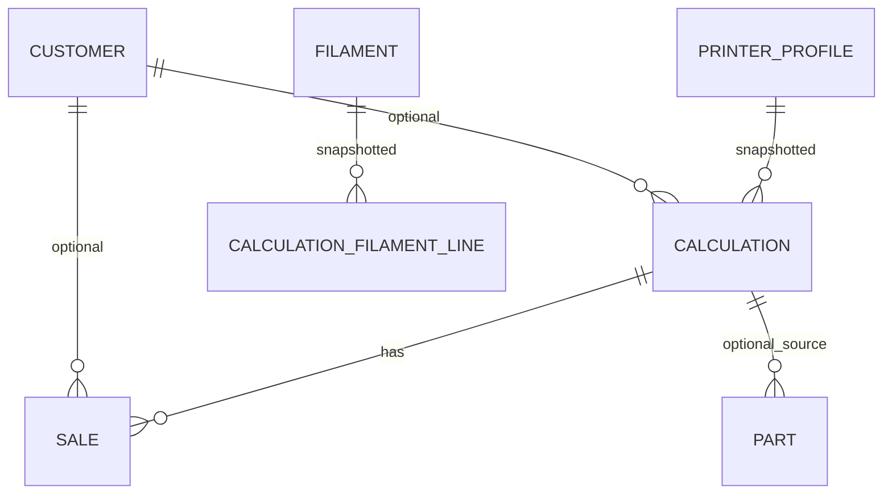

# Domain Contract

## Core Entities

| Entity | Required contract |
| --- | --- |
| PrinterProfile | `id`, `name`, `powerWatts`, `purchasePriceEur`, `lifetimeHours`, `electricityPriceEurKwh`, `annualBaseFeeEur`, optional `note`, timestamps, `deleted`. |
| Filament | `id`, unique active `name`, `type`, `colorHex`, optional `manufacturer`, `rollWeightG`, `remainingG`, `purchases[]`, `multiColorSurchargeEurKg`, optional `fixedPriceEurG`, timestamps, `deleted`. |
| Calculation | Calculation inputs, result outputs, `printerSnapshot`, `filamentSnapshot` per line, `timesPrinted`, timestamps, `deleted`. |
| Sale | `id`, `calculationId`, optional `customerId`, `salePriceEur`, `gifted`, `date`, optional `note`, `createdAt`. |
| Customer | `id`, `name`, optional `contact`, optional `note`, timestamps, `deleted`. |
| Part | `id`, `name`, optional `calculationId`, `quantity`, optional `note`, timestamps. |
| Settings | `defaultPriceMode`, `defaultProfitMarginPercent`, `defaultModelingCostEur`, `defaultMultiColorSurchargeEurKg`, `autoDeductFilamentOnSave`. |
| BackupFormat | `version`, `exportedAt`, all stores, and Settings. |

## Validation Floor

| Field | Rule |
| --- | --- |
| Printer `name` | 1-60 chars. |
| `powerWatts` | > 0 and <= 5000. |
| `purchasePriceEur`, `lifetimeHours`, `electricityPriceEurKwh` | > 0; electricity <= 10. |
| `annualBaseFeeEur` | >= 0. |
| Filament `name` | 1-60 chars, unique among active Filaments. |
| Filament `type` | `PLA`, `PETG`, `ABS`, `TPU`, `OTHER`. |
| `colorHex` | valid `#RRGGBB`. |
| `rollWeightG` | > 0 and <= 10000. |
| `remainingG` | >= 0 and <= `rollWeightG`, except print occurrence can clamp to 0. |
| Purchase `priceEur`, `quantityKg` | > 0. |
| Purchase `date`, sale `date` | valid ISO date. |
| Customer `name` | 1-80 chars. |
| Free text fields | Trimmed before storage; max 500 chars where PRD names a free-text limit. |
| Calculation numeric inputs | Required numeric fields must stay within PRD ranges; `extraWorkFeePercent` replaces PRD draft `multiPlateSurchargePercent`. |

## Calculation Formula

`printMinutes` and every `gramsUsed` are total job inputs. Plate count does not multiply material, electricity, base fee, or depreciation.

```text
plates = ceil(printQuantity / partsPerPlate)
electricityPerMinute = (powerWatts / 1000) * electricityPriceEurKwh / 60
baseFeePerMinute = annualBaseFeeEur / 365 / 24 / 60
depreciationPerMinute = purchasePriceEur / (lifetimeHours * 60)

materialCost = sum(gramsUsed[i] * pricePerGram[i])
electricityCost = (electricityPerMinute + baseFeePerMinute) * printMinutes
depreciationCost = depreciationPerMinute * printMinutes
modelingCost = modelExists ? 0 : modelingCostEur
subtotalBeforeFee = materialCost + electricityCost + depreciationCost + modelingCost
extraWorkFee = plates > 1 ? subtotalBeforeFee * extraWorkFeePercent / 100 : 0
subtotal = subtotalBeforeFee + extraWorkFee
finalPrice = subtotal * (1 + profitMarginPercent / 100)
roundedFinalPrice = ceil(finalPrice)
```

## Price Modes

| Mode | Rule |
| --- | --- |
| `WEIGHTED_AVERAGE` | `sum(priceEur * quantityKg) / sum(quantityKg) / 1000`. |
| `PAID` | Last purchase price per gram. |
| `FIXED` | Manual `fixedPriceEurG`; required and > 0 when used. |

## Persistence Rules

- IndexedDB v1 stores: `printers`, `filaments`, `calculations`, `sales`, `customers`, `templates`, `parts`, `settings`.
- IndexedDB has no foreign keys; services enforce referential behavior.
- Printer Profiles, Filaments, Customers, and Calculations use soft delete when historical references may exist.
- Calculation save stores snapshots and computed outputs, but does not deduct filament.
- Explicit print occurrence increments `timesPrinted` and deducts saved total `gramsUsed` from current Filament stock by saved `filamentId`, including soft-deleted Filaments.
- Low stock during print occurrence clamps `remainingG` to `0` and shows a German warning; missing Filament blocks the command with a German data error.
- Sale/Gift records update sold/gifted counts only; no filament deduction.
- Backup import validates full schema and version before replace-all mutation.

## Routes And Surfaces

| Route | German label | Owns |
| --- | --- | --- |
| `/calculate` | `Kalkulation` | New/saved Calculation, live result, templates load/save entry points. |
| `/inventory` | `Bestand` | `Drucke` for saved calculations and `Teile` for manual parts. |
| `/filaments` | `Filamente` | Filament list, filters, search, create/edit, purchase history. |
| `/more` | `Mehr` | Printer Profiles, Customers, Settings, Templates, export/import, data deletion, update status. |

## Entity Relationships



## Browser And Security Floor

- Supported browsers: iOS Safari 15.4+, Android Chrome 90+, desktop Chrome/Edge 90+, Firefox 90+, Safari 15.4+.
- Core workflows work offline after initial load.
- Service worker caches app shell and local assets only.
- Hosted CSP: `default-src 'self'; script-src 'self'; style-src 'self' 'unsafe-inline'; font-src 'self'; img-src 'self' data:; connect-src 'none'; frame-src 'none';`.
- Do not use `eval()` or unsafe user-input rendering.
